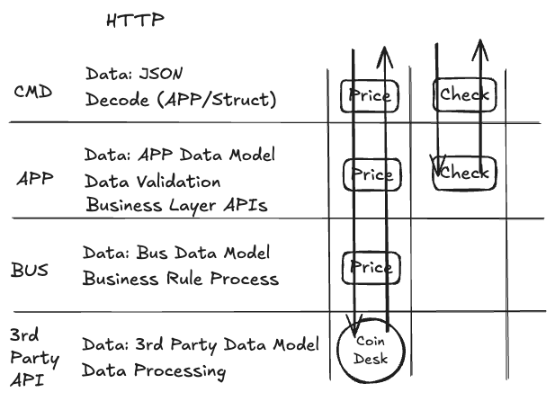

# btc-price-service

This service provides users with the current Bitcoin (BTC) price in USD. It relies on the CoinDesk API to fetch the latest price data.

## Business Rules

1. Clients connect to the service and stream the current BTC price in USD every 5 seconds.
    * Each update contains the current price in USD and the timestamp of the update.
    * Only changed prices are sent to the clients to minimize data transfer.
2. Clients automatically reconnects if the connection is lost.
3. During reconnection, if 'since' is provided, it will send the last N updates based on the timestamp and auto-resume the stream.
4. Cache is enabled by default to reduce API calls and improve response time.
5. The service has a simple auto-balance mechanism to distribute the broadcasters on subscriptions and unsubscriptions.

## Prerequisites

* Node.js (v20 or higher)
* npm (v11 or higher)
* Docker (optional, for running the service in a container)
* Go (v 1.24 or higher)

## Design Patterns

* **Domain-Driven Design (DDD)**: The application is structured around the business domain, with clear separation of concerns.

* **Cache**: The service uses a caching layer to store the latest BTC price and reduce API calls to CoinDesk.

* **Publisher-Subscriber**: The service uses a pub-sub model to broadcast updates to connected clients.



## Testing

* Unit tests can be run using `make test`. It also generates a coverage report.
* Integration tests can be run using `make test-integration`. This will start the service and run the integration tests against it with CoinDesk API mock.

## Running the Service Locally

1. Get an api key from CoinDesk.
    * Sign up at [CoinDesk](https://developers.coindesk.com/settings/api-keys) and obtain your api key.
2. Set the token in an environment variable or in a `.env` file.
    * Copy the `.env.example` file to `./configs/.env` and set your `COINDESK_API_KEY`.
3. Start the service:

    ```bash
    go run ./cmd/service
    ```

4. The service will start on port `17020` by default. You can change this in the `.env` file.
5. Start the frontend application:

    ```bash
    npm install
    npm run dev
    ```

6. Open your browser and navigate to `http://localhost:3000` to see the current BTC price.

## Next Steps

* Double check the caching strategy for the CoinDesk API, ensuring it respects the 30-second limit for the toplist endpoint.
* Implement backoff and retry logic for API calls to handle rate limiting and temporary failures.
* Follow metrics and logging best practices to monitor the service's performance and health and adjust caching and broadcasting values as needed.
* Prevent panic in the service and ensure it recovers gracefully from unexpected errors, including the http server and all goroutines spawned.
* Implement middlewares for logging, metrics, and error handling to improve observability and maintainability.

Made with :heart: by Gandarez
